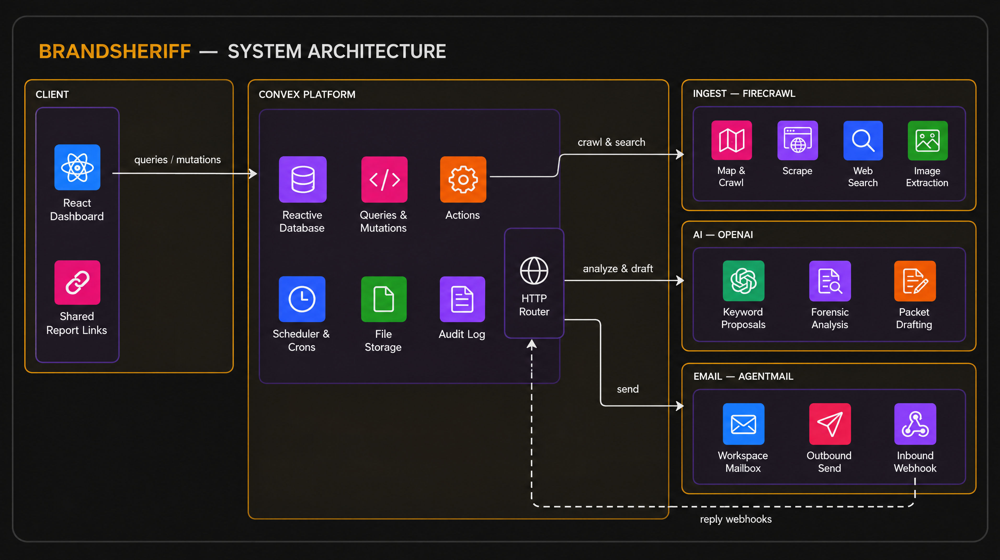
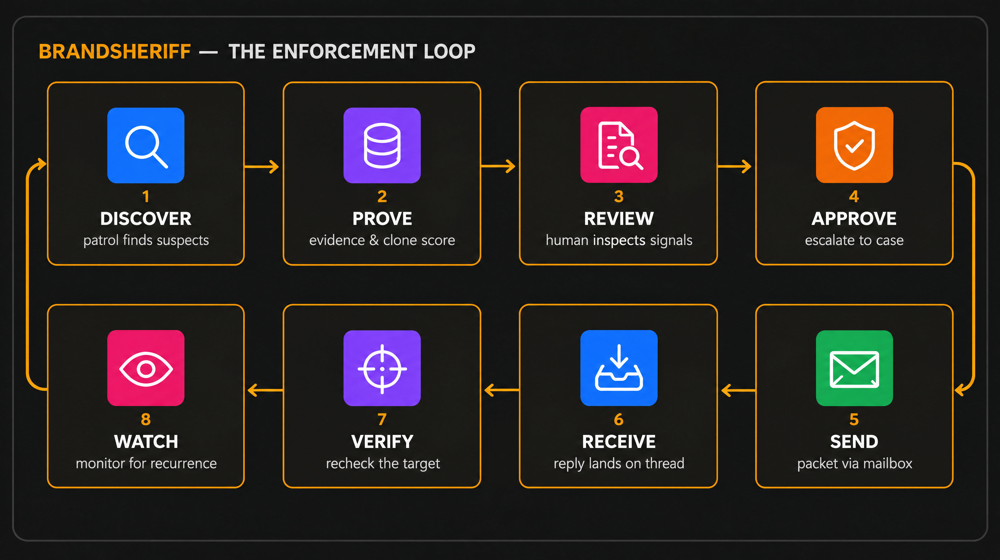
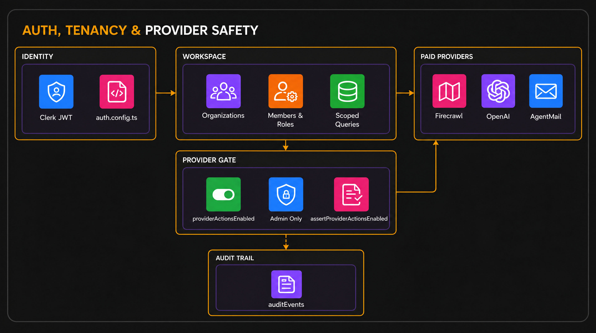
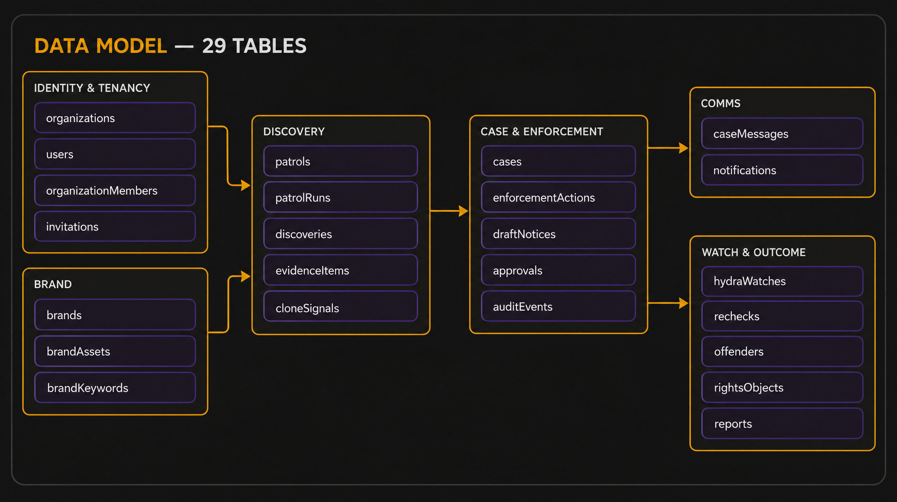
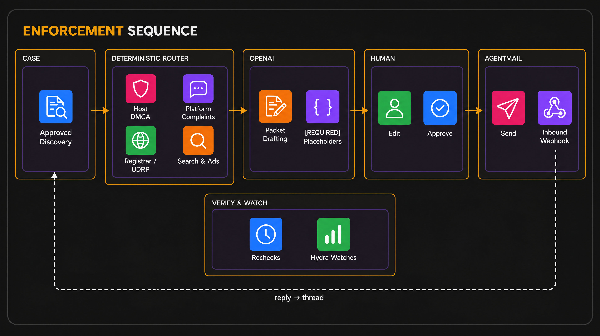
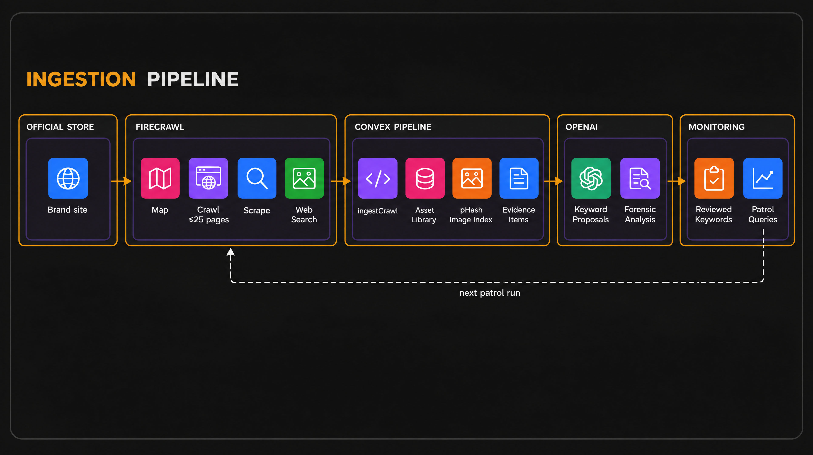

# BrandSheriff

**Find copycats. Prove the infringement. Enforce removal — with a human approving every send.**

**Live app**: [cautious-elk-17.convex.site](https://cautious-elk-17.convex.site) · **Zero-login judge demo**: [/showcase](https://cautious-elk-17.convex.site/showcase) · Built for the [Convex All Gas Hackathon](https://www.convex.dev/hackathons/all-gas)


## Table of Contents

- [Overview](#overview)
- [System Architecture](#system-architecture)
- [The Enforcement Loop](#the-enforcement-loop)
- [Integrations](#integrations)
  - [Convex — the backbone](#convex--the-backbone)
  - [Firecrawl — the eyes](#firecrawl--the-eyes)
  - [OpenAI — the analyst](#openai--the-analyst)
  - [AgentMail — the voice](#agentmail--the-voice)
- [Trust Boundaries: Auth, Tenancy & Provider Safety](#trust-boundaries-auth-tenancy--provider-safety)
- [Data Model](#data-model)
- [Enforcement Sequence](#enforcement-sequence)
- [Ingestion Pipeline](#ingestion-pipeline)
- [Repository Layout](#repository-layout)
- [Running Locally](#running-locally)
- [Verification](#verification)

## Overview

BrandSheriff is a multi-tenant brand-protection platform for e-commerce companies. Any brand doing meaningful volume gets copied — listing hijackers, counterfeits on overseas marketplaces, shop clones, store dupes, ripped ads, keyword squatters — and the existing answer is a pile of disconnected tools: reverse image search, spreadsheets, inboxes, and hand-written legal drafts.

BrandSheriff replaces that pile with one system that carries the entire loop:

**DISCOVER → PROVE → REVIEW → APPROVE → SEND → RECEIVE → VERIFY → WATCH**

The central design constraint: **enforcement is high-consequence work, so AI never decides liability and never acts alone.** The codebase enforces that split deliberately:

| Concern | Owner |
|---|---|
| Scoring, routing, thresholds | Deterministic TypeScript — auditable, testable, same inputs → same outputs |
| Research, analysis, drafting | OpenAI — always framed as proposals, never verdicts |
| Send authority | A human — every outbound action requires explicit approval |
| Accountability | A Convex audit trail — every mutation, approval, and provider call is recorded |

## System Architecture



The frontend is a React + Vite SPA talking to a single Convex deployment over queries, mutations, and actions. Convex owns all state, orchestration, scheduling, and file storage. Three paid providers plug into server-side actions only — never from the browser — behind a per-workspace provider gate. AgentMail replies return through a signed HTTP webhook on the same deployment.

## The Enforcement Loop



1. **Discover** — patrols run real web searches for pages using the brand name, variants like "official" and "sale", and owner-approved monitoring keywords. Any URL can also be investigated directly through the same scrape-and-analyze path.
2. **Prove** — each suspect is scraped and scored: text similarity, perceptual-hash image matching against the brand's indexed imagery, keyword attribution, and channel hints combine into a clone score (0–100) whose every input is inspectable.
3. **Review** — a human opens the discovery, expands the signal breakdown, compares suspect vs. original imagery side by side, and decides.
4. **Approve** — approving escalates the discovery into a case, where deterministic routing computes the correct enforcement channels and OpenAI drafts a platform-native packet per route with `[REQUIRED: …]` placeholders for anything it cannot verify.
5. **Send** — the human edits, approves, and sends. AgentMail delivers from the workspace's own provisioned mailbox.
6. **Receive** — replies arrive through a signed webhook, land on the case thread, and are classified (takedown confirmed, needs info, dispute, counter-notice…).
7. **Verify** — scheduled rechecks re-scrape the target URL to confirm it actually came down.
8. **Watch** — Hydra watches keep polling the page and the offender graph tracks related infringements, so a removal that resurfaces elsewhere gets caught again.

## Integrations

### Convex — the backbone

Convex is not a database here — it is the application platform. Every subsystem below lives in [`convex/`](https://github.com/Abraham12611/BrandSheriff/tree/main/convex) and runs on one deployment.

- **Data model** — 29 tables spanning tenancy, brands, discovery, cases, enforcement, comms, and outcomes: [`convex/schema.ts`](https://github.com/Abraham12611/BrandSheriff/blob/main/convex/schema.ts)
- **Realtime UI** — the React app is entirely `useQuery`/`useMutation`/`useAction`; every screen (discoveries inbox, case detail, routes panel, inbox) is live without a state-management layer: [`src/pages/CaseDetail.tsx`](https://github.com/Abraham12611/BrandSheriff/blob/main/src/pages/CaseDetail.tsx), [`src/components/enforcement/RoutesPanel.tsx`](https://github.com/Abraham12611/BrandSheriff/blob/main/src/components/enforcement/RoutesPanel.tsx)
- **Scheduled work** — an hourly Hydra sweep and a Monday-morning weekly digest are declared in code: [`convex/crons.ts`](https://github.com/Abraham12611/BrandSheriff/blob/main/convex/crons.ts)
- **HTTP router** — signed inbound webhooks terminate on the deployment: `/agentmail/webhook`, `/monitor/webhook`: [`convex/http.ts`](https://github.com/Abraham12611/BrandSheriff/blob/main/convex/http.ts)
- **Durable workflows** — post-send follow-up (wait for reply → recheck target → record outcome) runs as a real `@convex-dev/workflow` definition, surviving across hours and days: [`convex/enforcementFlow.ts`](https://github.com/Abraham12611/BrandSheriff/blob/main/convex/enforcementFlow.ts)
- **Components** — mounted in one config file: static hosting, the official Firecrawl component, a vendored AgentMail component, and workflow: [`convex/convex.config.ts`](https://github.com/Abraham12611/BrandSheriff/blob/main/convex/convex.config.ts)
- **Static hosting** — the entire SPA plus the controlled demo storefronts are served from Convex itself: [`@convex-dev/static-hosting`](https://github.com/Abraham12611/BrandSheriff/blob/main/convex/convex.config.ts), demo fixtures at [`public/demo/`](https://github.com/Abraham12611/BrandSheriff/tree/main/public/demo)
- **Auth** — Clerk JWT verification wired through Convex auth config: [`convex/auth.config.ts`](https://github.com/Abraham12611/BrandSheriff/blob/main/convex/auth.config.ts)
- **Audit trail** — every security-relevant write appends to `auditEvents`, queryable per case and per workspace: [`convex/auditEvents.ts`](https://github.com/Abraham12611/BrandSheriff/blob/main/convex/auditEvents.ts)
- **Deterministic scoring** — the clone score is pure TypeScript with unit tests, not a model call: [`convex/cloneScore.ts`](https://github.com/Abraham12611/BrandSheriff/blob/main/convex/cloneScore.ts), [`convex/cloneScore.test.ts`](https://github.com/Abraham12611/BrandSheriff/blob/main/convex/cloneScore.test.ts)
- **Public judge surface** — a token-gated seeder runs the *real* pipeline into an isolated demo organization, and a scoped public query exposes only that org's data: [`convex/demoShowcase.ts`](https://github.com/Abraham12611/BrandSheriff/blob/main/convex/demoShowcase.ts), [`src/pages/Showcase.tsx`](https://github.com/Abraham12611/BrandSheriff/blob/main/src/pages/Showcase.tsx)

### Firecrawl — the eyes

Firecrawl is mounted as a Convex component and wrapped by a thin API client; every call is provider-gated and audit-logged.

- **Brand DNA crawl** — `map` + `crawl` against the official store (up to 25 pages), with a webhook-driven completion that runs the real ingestion path: [`convex/brandDna.ts`](https://github.com/Abraham12611/BrandSheriff/blob/main/convex/brandDna.ts)
- **Patrol search** — Firecrawl web search finds candidate infringers from brand terms and approved keywords: [`convex/patrol.ts`](https://github.com/Abraham12611/BrandSheriff/blob/main/convex/patrol.ts)
- **Suspect forensics** — on-demand scrape + analysis for any URL, feeding evidence items and signals: [`convex/forensics.ts`](https://github.com/Abraham12611/BrandSheriff/blob/main/convex/forensics.ts)
- **Live-browser evidence** — Firecrawl interact sessions capture a real browser session against a suspect page as preserved proof: [`convex/interact.ts`](https://github.com/Abraham12611/BrandSheriff/blob/main/convex/interact.ts)
- **Change monitoring** — provisioned page monitors detect takedowns and re-listings, reported back through `/monitor/webhook`: [`convex/monitors.ts`](https://github.com/Abraham12611/BrandSheriff/blob/main/convex/monitors.ts), [`convex/http.ts`](https://github.com/Abraham12611/BrandSheriff/blob/main/convex/http.ts)
- **Client + component mount** — [`convex/lib/firecrawlApi.ts`](https://github.com/Abraham12611/BrandSheriff/blob/main/convex/lib/firecrawlApi.ts), [`convex/convex.config.ts`](https://github.com/Abraham12611/BrandSheriff/blob/main/convex/convex.config.ts)
- **Visual matching** — crawled imagery is fetched and perceptual-hashed server-side, then scored against suspect images: [`convex/images.ts`](https://github.com/Abraham12611/BrandSheriff/blob/main/convex/images.ts), [`convex/lib/phash.ts`](https://github.com/Abraham12611/BrandSheriff/blob/main/convex/lib/phash.ts)

### OpenAI — the analyst

OpenAI is used exactly where judgment-shaped text helps and nowhere near the decision path. All calls are `gpt-4o-mini`, low-temperature, provider-gated, and constrained by prompts that forbid invented facts.

- **Keyword intelligence** — proposes monitoring terms (brand, product, variant, misspelling, marketplace) that a human must explicitly accept before patrols use them: [`convex/keywords.ts`](https://github.com/Abraham12611/BrandSheriff/blob/main/convex/keywords.ts)
- **Packet drafting** — drafts each route's platform-native complaint (DMCA, trademark, counterfeit, UDRP, counsel brief), instructed to emit `[REQUIRED: …]` placeholders rather than fabricate registrations, dates, or recipients: [`convex/enforcementRoutes.ts`](https://github.com/Abraham12611/BrandSheriff/blob/main/convex/enforcementRoutes.ts), [`convex/enforcement.ts`](https://github.com/Abraham12611/BrandSheriff/blob/main/convex/enforcement.ts)
- **Forensic analysis** — summarizes observable copying for reviewer context; signals and scores remain deterministic: [`convex/forensics.ts`](https://github.com/Abraham12611/BrandSheriff/blob/main/convex/forensics.ts)
- **Reply triage** — classifies inbound enforcement replies and proposes the next state, applied through reviewable mutations: [`convex/replyClassification.ts`](https://github.com/Abraham12611/BrandSheriff/blob/main/convex/replyClassification.ts)
- **Contact-route research** — scrapes the target and registry data to propose abuse contacts: [`convex/contactResearch.ts`](https://github.com/Abraham12611/BrandSheriff/blob/main/convex/contactResearch.ts)
- **Clean output contract** — every draft is normalized to plain text at generation, on edit, and on send, so markdown syntax can never leak into an email body: [`convex/lib/plainText.ts`](https://github.com/Abraham12611/BrandSheriff/blob/main/convex/lib/plainText.ts), [`convex/lib/openai.ts`](https://github.com/Abraham12611/BrandSheriff/blob/main/convex/lib/openai.ts)

### AgentMail — the voice

Each workspace gets its own mailbox — a real pod, inbox, and webhook — so enforcement email is a first-class, threaded part of the data model rather than an external inbox.

- **Pod provisioning** — creates the workspace pod + inbox and registers the webhook against the deployment's site URL: [`convex/mailProvision.ts`](https://github.com/Abraham12611/BrandSheriff/blob/main/convex/mailProvision.ts)
- **Vendored component** — the AgentMail component is vendored into the repo so env scoping and action visibility are explicit: [`components/agentmail/`](https://github.com/Abraham12611/BrandSheriff/tree/main/components/agentmail)
- **Send + approve path** — `approveAndSend` requires a human-approved draft, sends via the workspace inbox, and records `outboundId`/delivery status: [`convex/enforcement.ts`](https://github.com/Abraham12611/BrandSheriff/blob/main/convex/enforcement.ts), [`convex/mail.ts`](https://github.com/Abraham12611/BrandSheriff/blob/main/convex/mail.ts)
- **Inbound → case thread** — the signed webhook resolves each reply to the right case, stores attachments into evidence, and flags unmatched mail for manual assignment: [`convex/http.ts`](https://github.com/Abraham12611/BrandSheriff/blob/main/convex/http.ts), [`convex/mailInbound.ts`](https://github.com/Abraham12611/BrandSheriff/blob/main/convex/mailInbound.ts)
- **Weekly digest + alerts** — Monday digest of discoveries, case movement, and outcomes to members who haven't opted out; discovery and watch-hit alerts in between: [`convex/mailAlerts.ts`](https://github.com/Abraham12611/BrandSheriff/blob/main/convex/mailAlerts.ts), [`convex/crons.ts`](https://github.com/Abraham12611/BrandSheriff/blob/main/convex/crons.ts), [`convex/notifications.ts`](https://github.com/Abraham12611/BrandSheriff/blob/main/convex/notifications.ts)

## Trust Boundaries: Auth, Tenancy & Provider Safety



- **Multi-tenancy** — every public query/mutation is workspace-scoped through membership checks; record-level helpers (`requireCaseAccess`, `requireDraftAccess`, `requireOrganizationMembership`) enforce it: [`convex/lib/authz.ts`](https://github.com/Abraham12611/BrandSheriff/blob/main/convex/lib/authz.ts), [`convex/authzActions.ts`](https://github.com/Abraham12611/BrandSheriff/blob/main/convex/authzActions.ts)
- **Provider gate** — paid provider calls are off by default per workspace and require an owner/admin to enable; every action asserts it: [`convex/providerSafety.ts`](https://github.com/Abraham12611/BrandSheriff/blob/main/convex/providerSafety.ts), [`convex/organizations.ts`](https://github.com/Abraham12611/BrandSheriff/blob/main/convex/organizations.ts)
- **Tested boundaries** — authorization and provider-safety behavior are covered by convex-test suites: [`convex/authorization.test.ts`](https://github.com/Abraham12611/BrandSheriff/blob/main/convex/authorization.test.ts), [`convex/prototypeSafety.test.ts`](https://github.com/Abraham12611/BrandSheriff/blob/main/convex/prototypeSafety.test.ts)

## Data Model



29 tables in six domains. Workspace-owned rows carry `organizationId` for scoping; case-owned artifacts carry `caseId` so a case is a complete, auditable dossier — discovery, evidence, routes, drafts, messages, approvals, rechecks — in one queryable unit.

Full schema: [`convex/schema.ts`](https://github.com/Abraham12611/BrandSheriff/blob/main/convex/schema.ts)

## Enforcement Sequence



Approving a discovery creates a case; the deterministic router computes route channels — host DMCA, storefront copyright, registrar abuse, UDRP assessment, search delisting, ads trademark/counterfeit, marketplace counterfeit, cease & desist, counsel escalation — each with its own lifecycle (`recommended → prepared → submitted → platform_reviewing → actioned | rejected | counter_notice | withdrawn`). OpenAI drafts one packet per route; the human picks, edits, and sends through AgentMail; replies return to the thread via webhook; rechecks and Hydra watches confirm and keep watching.

Route computation: [`convex/enforcementRoutes.ts`](https://github.com/Abraham12611/BrandSheriff/blob/main/convex/enforcementRoutes.ts) · UI: [`src/components/enforcement/RoutesPanel.tsx`](https://github.com/Abraham12611/BrandSheriff/blob/main/src/components/enforcement/RoutesPanel.tsx)

## Ingestion Pipeline



One crawl seeds everything downstream: real page content lands in the asset library and evidence items, imagery is fetched and pHashed into the visual index, OpenAI proposes keywords for owner review, and accepted terms feed patrol queries that find the next round of suspects.

Pipeline code: [`convex/brandDna.ts`](https://github.com/Abraham12611/BrandSheriff/blob/main/convex/brandDna.ts), [`convex/images.ts`](https://github.com/Abraham12611/BrandSheriff/blob/main/convex/images.ts), [`convex/keywords.ts`](https://github.com/Abraham12611/BrandSheriff/blob/main/convex/keywords.ts), [`convex/patrol.ts`](https://github.com/Abraham12611/BrandSheriff/blob/main/convex/patrol.ts)

## Repository Layout

```
convex/            Backend: schema, functions, crons, http router, components config
convex/lib/        Shared internals: authz, provider clients, phash, plainText
components/        Vendored Convex components (agentmail)
src/pages/         App screens: Dashboard, Discoveries, Cases, CaseDetail, Rights,
                   Networks, Reports, Analytics, Settings, Showcase, Onboarding
src/components/    Shell, enforcement panels, discovery cards, shared UI
public/demo/       Controlled demo storefronts + demo infographics (fixtures only)
.github/           CI: typecheck, lint, test, build on every push
```

## Running Locally

```bash
npm install

# Convex backend (dev deployment) — set provider keys on the deployment:
npx convex env set FIRECRAWL_API_KEY "fc-…"
npx convex env set OPENAI_API_KEY "sk-…"
npx convex env set AGENTMAIL_API_KEY "am_…"
npx convex env set AGENTMAIL_WEBHOOK_SECRET "…"
npx convex env set CLERK_FRONTEND_API_URL "https://….clerk.accounts.dev"
npx convex dev

# Frontend — copy .env.local.example to .env.local and set:
#   VITE_CONVEX_URL, VITE_CLERK_PUBLISHABLE_KEY
npm run dev
```

Provider actions are **off by default** in every workspace — enable them from Settings as an owner/admin before crawls, patrols, drafting, or mail will run.

## Verification

```bash
npm run check   # tsc (app + tests + convex) · eslint · 41 vitest/convex-test tests · vite build
```

CI runs the same pipeline on every push: [`.github/workflows/ci.yml`](https://github.com/Abraham12611/BrandSheriff/blob/main/.github/workflows/ci.yml)
